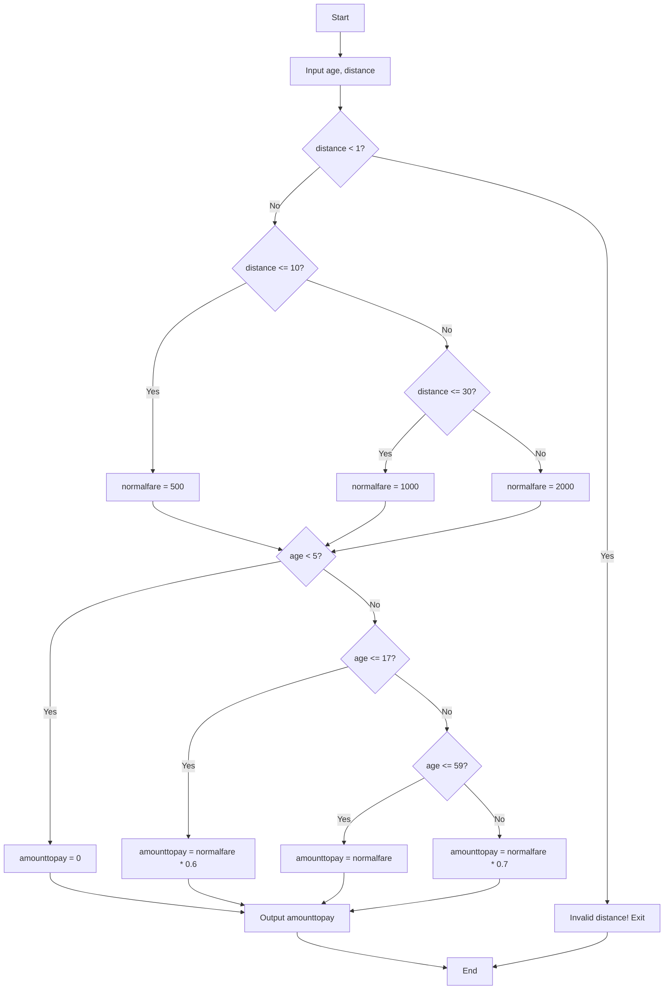
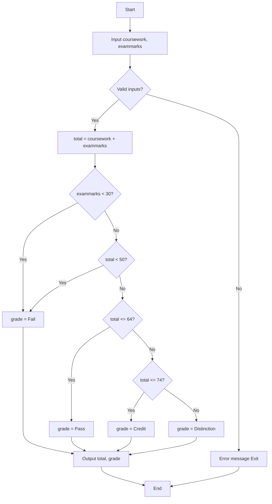
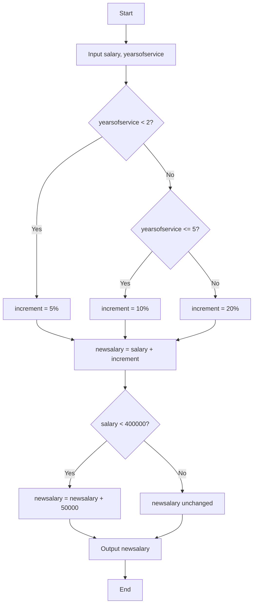
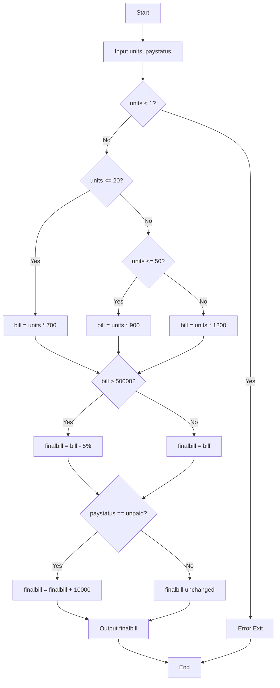
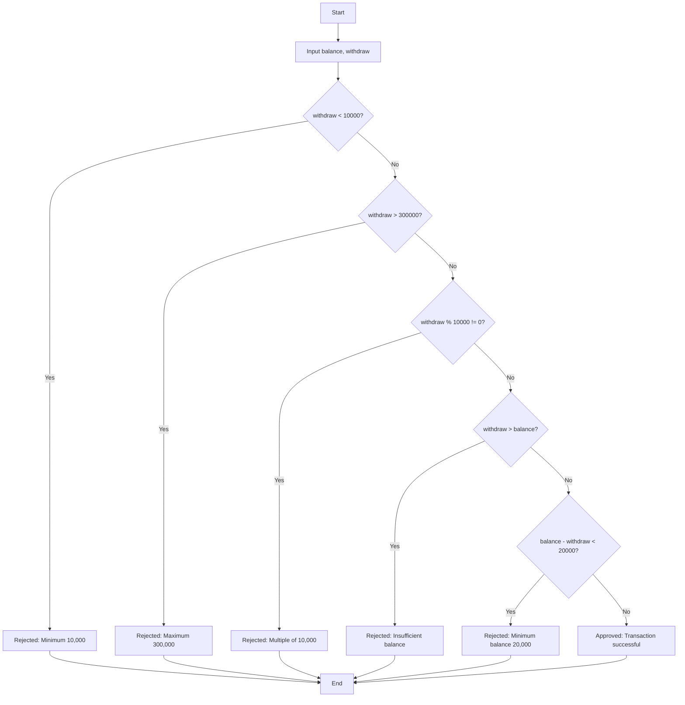
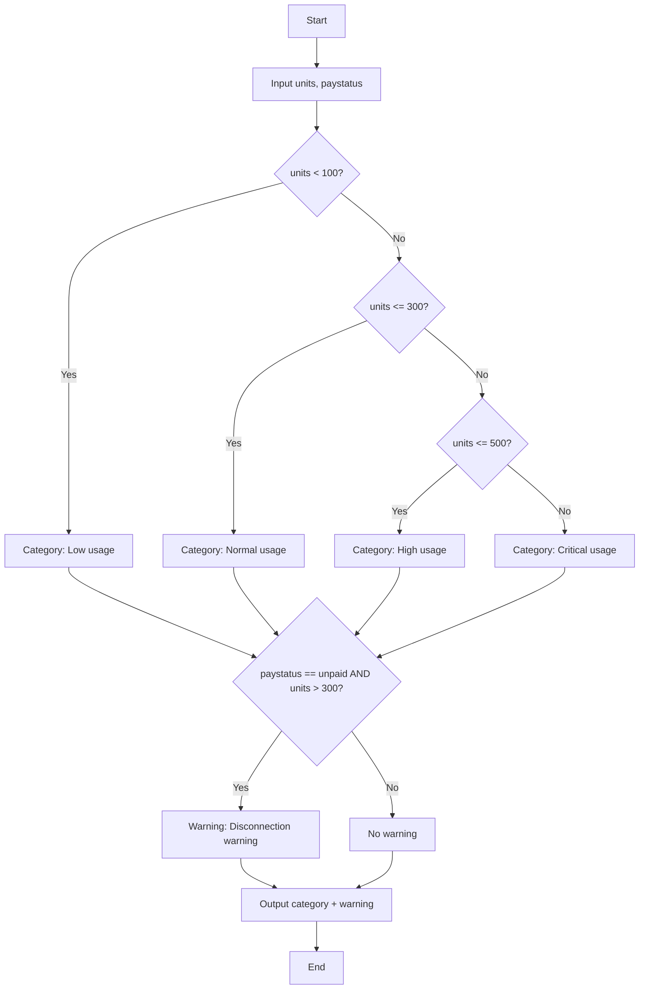
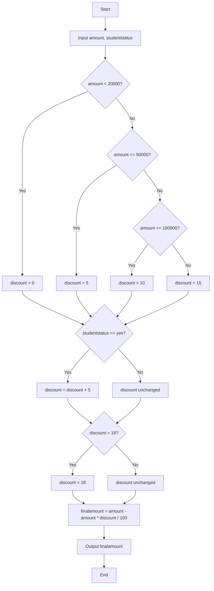
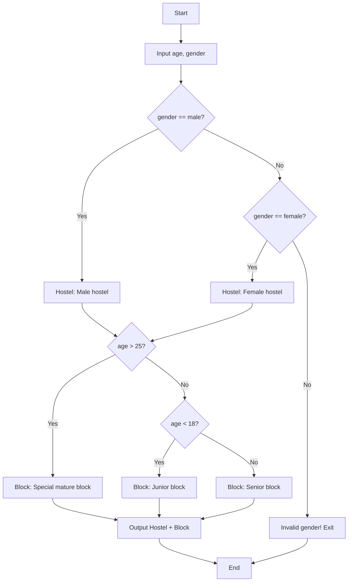
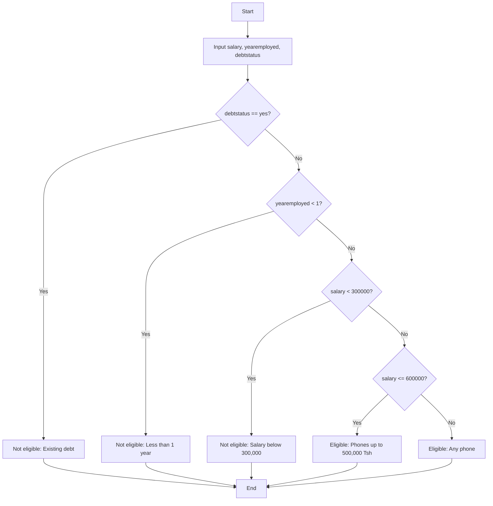

# 📚 C++ Programming Practical Assignments

## 👨‍💻 Author Information

**MADE BY antaresx VIA system group zas, Aloyce, bannister xibs**  
**Contact:** wa.me/antaresxibs

> ⚠️ **WARNING: DON'T COPY JUST UNDERSTAND**  
> These solutions are for learning purposes only. Understand the logic and write your own code.

---

## 📁 File Structure

| File Name | Problem Description |
|-----------|---------------------|
| `1.cpp` | Bus Fare Determination |
| `2.cpp` | Student Examination Result |
| `3.cpp` | Salary Increment Decision |
| `4.cpp` | Water Bill Calculation |
| `5.cpp` | ATM Withdrawal Validation |
| `6.cpp` | Electricity Usage Monitoring |
| `7.cpp` | Shop Discount Calculation |
| `8.cpp` | Hostel Room Allocation |
| `10.cpp` | Phone Installment Eligibility |

---

## 🧠 Common Rules Across All Solutions

- ✅ **Only `if`, `else if`, `else` statements** (no complex logic)
- ✅ **No `&&` operator** - only `||` where needed
- ✅ **Variable names in lowercase** (e.g., `newsalary`, not `newSalary`)
- ✅ **`\n` instead of `endl`**
- ✅ **Colorized output** (Magenta = info, Red = errors/warnings)
- ✅ **Input validation** included

---

# 📝 Problem 1: Bus Fare Determination
**File:** `1.cpp`

### 📖 Description
A transport company charges bus fare based on passenger's age and distance travelled.

### 📊 Rules
| Distance | Normal Fare |
|----------|-------------|
| 1-10 km | 500 Tsh |
| 11-30 km | 1,000 Tsh |
| Above 30 km | 2,000 Tsh |

| Age Group | Discount |
|-----------|----------|
| Below 5 years | Free (100% off) |
| 5-17 years | 40% off (pay 60%) |
| 18-59 years | No discount (pay full) |
| 60+ years | 30% off (pay 70%) |

### 🔄 Algorithm Flowchart



📌 Example Run

```
Input: age = 25, distance = 15 km
Normal fare = 1000 Tsh
Age 25 → Adult → Full fare = 1000 Tsh
Output: Amount to pay: 1000 Tsh
```

---

📝 Problem 2: Student Examination Result

File: 2.cpp

📖 Description

College computes final result based on coursework (out of 40) and final exam (out of 60).

📊 Grading Rules

Total Marks Grade
Below 50 Fail
50-64 Pass
65-74 Credit
75+ Distinction

⚠️ Special Rule: If exam mark < 30 → Automatic Fail (regardless of total)

🔄 Algorithm Flowchart



📌 Example Run

```
Input: coursework = 35, exammarks = 40
Total = 75
Exam >= 30 → Check total
Grade = Distinction
Output: Total: 75, Grade: Distinction
```

---

📝 Problem 3: Salary Increment Decision

File: 3.cpp

📖 Description

Company increases employee salaries based on years of service with additional hardship allowance.

📊 Rules

Years of Service Increment
Less than 2 years 5%
2 to 5 years 10%
More than 5 years 20%

Additional Rule
If salary < 400,000 Tsh → Add 50,000 hardship allowance

🔄 Algorithm Flowchart



📌 Example Run

```
Input: salary = 300,000, yearsofservice = 3
Increment = 10% = 30,000 → New salary = 330,000
Salary < 400,000 → Add 50,000
Output: New salary: 380,000 Tsh
```

---

📝 Problem 4: Water Bill Calculation

File: 4.cpp

📖 Description

Water utility charges based on units consumed with discounts and penalties.

📊 Rules

Units Consumed Rate per Unit
1-20 units 700 Tsh
21-50 units 900 Tsh
Above 50 units 1,200 Tsh

Additional Rules
Bill > 50,000 Tsh → 5% discount
Late payment (unpaid) → +10,000 Tsh penalty

🔄 Algorithm Flowchart



---

📝 Problem 5: ATM Withdrawal Validation

File: 5.cpp

📖 Description

ATM system validates withdrawal requests with multiple conditions.

📊 Rules

Condition Requirement
Minimum amount 10,000 Tsh
Maximum amount 300,000 Tsh
Multiples Must be in multiples of 10,000
Sufficient balance withdrawal ≤ balance
Minimum remaining balance - withdrawal ≥ 20,000 Tsh

🔄 Algorithm Flowchart



---

📝 Problem 6: Electricity Usage Monitoring

File: 6.cpp

📖 Description

Household electricity monitoring system classifies usage and issues warnings.

📊 Rules

Units Consumed Category
Below 100 Low usage
100 - 300 Normal usage
301 - 500 High usage
Above 500 Critical usage

Warning Rule
If unpaid AND usage > 300 → Disconnection warning

🔄 Algorithm Flowchart



---

📝 Problem 7: Shop Discount Calculation

File: 7.cpp

📖 Description

Retail shop offers discounts based on purchase amount with extra student discount.

📊 Rules

Purchase Amount Base Discount
Below 20,000 Tsh 0%
20,000 - 50,000 Tsh 5%
50,001 - 100,000 Tsh 10%
Above 100,000 Tsh 15%

Additional Rules
Students get extra 5% discount
Maximum total discount = 18%

🔄 Algorithm Flowchart



---

📝 Problem 8: Hostel Room Allocation

File: 8.cpp

📖 Description

College assigns hostel rooms based on student age and gender.

📊 Rules

Gender Hostel
Male Male hostel
Female Female hostel

Age Block
Below 18 Junior block
18 - 25 Senior block
Above 25 Special mature students' block

🔄 Algorithm Flowchart



---

📝 Problem 10: Phone Installment Eligibility

File: 10.cpp

📖 Description

Phone shop determines customer eligibility for installment purchases.

📊 Rules

Condition Result
Has existing debt ❌ Not eligible
Employed < 1 year ❌ Not eligible
Salary < 300,000 Tsh ❌ Not eligible
Salary 300,000 - 600,000 Tsh ✅ Eligible for phones up to 500,000 Tsh
Salary > 600,000 Tsh ✅ Eligible for any phone

🔄 Algorithm Flowchart



---

🛠️ How to Compile and Run

Compile any program:

```bash
g++ 1.cpp -o 1
```

Run:

```bash
./1
```

Compile all at once:

```bash
for i in 1 2 3 4 5 6 7 8 10; do g++ $i.cpp -o $i; done
```

---

📌 Notes for Students

1. Read the problem carefully before looking at the solution
2. Trace the flowchart with sample inputs to understand the logic
3. Modify and experiment - change values, add features
4. Don't just copy - write your own version from understanding
5. Ask questions if something is unclear

---

📞 Contact

MADE BY antaresx VIA system group zas, Aloyce, bannister xibs
WhatsApp: wa.me/antaresxibs

⚠️ REMEMBER: DON'T COPY JUST UNDERSTAND ⚠️

---

📄 License

These solutions are for educational purposes only. Use them to learn programming logic, not to submit as your own work.

---

Happy Learning! 🚀

